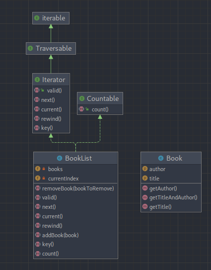

# Iterator (Итератор)

**Итератор** — это поведенческий паттерн проектирования, который даёт возможность последовательно обходить элементы
составных объектов, не раскрывая их внутреннего представления.

---

### UML Diagram

---

# Когда использовать?

1. Когда у вас есть сложная структура данных, и вы хотите скрыть от клиента детали её реализации (из-за сложности или
   вопросов безопасности).
2. Когда вам нужно иметь несколько вариантов обхода одной и той же структуры данных.
3. Когда вам хочется иметь единый интерфейс обхода различных структур данных.

# How to run tests?
./vendor/bin/phpunit src/Behavioral/Iterator/Tests