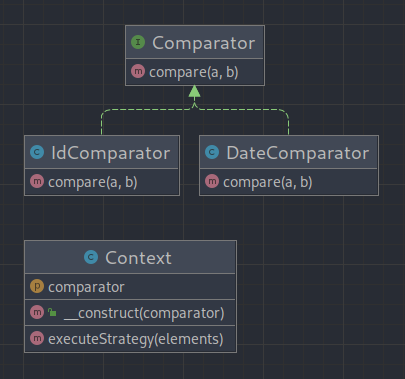

# Strategy (Стратегия)

**Стратегия** — это поведенческий паттерн проектирования, который определяет семейство схожих алгоритмов и помещает
каждый из них в собственный класс. После чего, алгоритмы можно взаимозаменять прямо во время исполнения программы.

---

### UML Diagram

---

# Когда использовать?

1. Когда вам нужно использовать разные вариации какого-то алгоритма внутри одного объекта.
2. Когда у вас есть множество похожих классов, отличающихся только некоторым поведением.
3. Когда вы не хотите обнажать детали реализации алгоритмов для других классов.
4. Когда различные вариации алгоритмов реализованы в виде развесистого условного оператора. Каждая ветка такого
   оператора представляет вариацию алгоритма.

# How to run tests?

./vendor/bin/phpunit src/Behavioral/Strategy/Tests