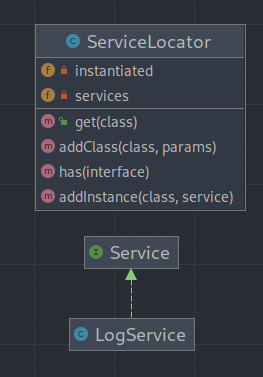

# Service locator (Локатор служб)

### Этот шаблон считается анти-паттерном!

**Локатор служб** — Используют для реализации слабосвязанной архитектуры, чтобы получить хорошо тестируемый,
сопровождаемый и расширяемый код. Паттерн Инъекция зависимостей (DI) и паттерн Локатор Служб — это реализация паттерна
Инверсия управления (Inversion of Control, IoC).

# Использование

С **Локатором Служб** вы можете зарегистрировать сервис для определенного интерфейса.

С помощью **интерфейса** вы можете получить зарегистрированный сервис и использовать его в классах приложения, не зная
его реализацию. Вы можете настроить и внедрить объект Service Locator на начальном этапе сборки приложения.

---

### UML Diagram

---

# How to run tests?

`./vendor/bin/phpunit src/More/ServiceLocator/Tests`