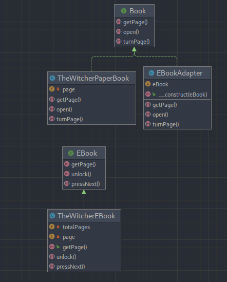

# Adapter (Адаптер)

**Адаптер** — это структурный паттерн проектирования, который позволяет объектам с несовместимыми интерфейсами работать
вместе.

---

### UML Diagram

---

# Когда использовать?

1. Когда вы хотите использовать сторонний класс, но его интерфейс не соответствует остальному коду приложения.
2. Когда вам нужно использовать несколько существующих подклассов, но в них не хватает какой-то общей функциональности.
   Причём расширять суперкласс вы не можете.

# How to run tests?

`./vendor/bin/phpunit src/Structural/Adapter/Tests`