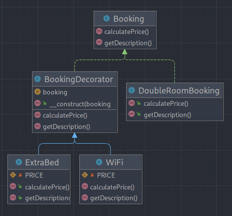

# Decorator (Декоратор)

**Декоратор** — это структурный паттерн проектирования, который позволяет динамически добавлять объектам новую
функциональность, оборачивая их в полезные «обёртки».

---

### UML Diagram

---

# Когда использовать?

1. Когда вам нужно добавлять обязанности объектам на лету, незаметно для кода, который их использует.
2. Когда нельзя расширить обязанности объекта с помощью наследования.

# How to run tests?

`./vendor/bin/phpunit src/Structural/Decorator/Tests`