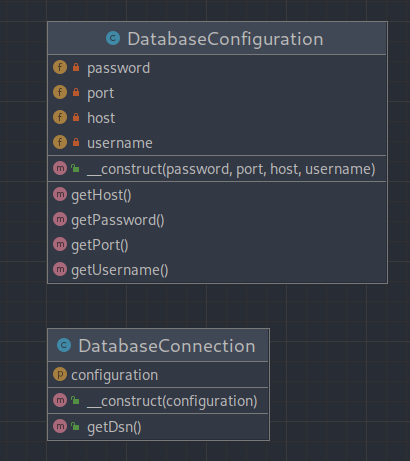

# Dependency injection (Внедрение зависимости)

**Dependency injection** — Служит для того, чтобы **реализовать слабосвязанную архитектуру**, чтобы получить лучший
тестируемый, поддерживаемый и расширяемый код.

---

### UML Diagram

---

# Использование

`DatabaseConfiguration` gets injected and `DatabaseConnection` will get all that it needs from `$config`.

Without **DI**, the configuration would be created directly in DatabaseConnection, which is not very good for testing
and extending it.

# How to run tests?

`./vendor/bin/phpunit src/Structural/DependencyInjection/Tests`