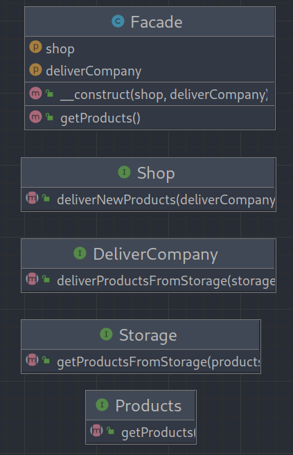

# Facade (Фасад)

**Фасад** — это структурный паттерн проектирования, который предоставляет простой интерфейс к сложной системе классов,
библиотеке или фреймворку.

# Проблема

Вашему коду приходится работать с большим количеством объектов некой сложной библиотеки или фреймворка. Вы должны
самостоятельно инициализировать эти объекты, следить за правильным порядком зависимостей и так далее.
 

В результате, бизнес-логика ваших классов тесно переплетается с деталями реализации сторонних классов. Такой код
довольно сложно понимать и поддерживать.

# Решение

Фасад — это простой интерфейс работы со сложной подсистемой, содержащей множество классов. Фасад может иметь урезанный
интерфейс, не имеющий 100% функциональности, которую можно достичь, используя сложную подсистему напрямую. Но он
предоставляет именно те фичи, которые нужны клиенту, и скрывает все остальное.
 

Фасад полезен, если вы используете какую-то сложную библиотеку с множеством подвижных частей, но вам нужна только часть
её возможностей.

---

### UML Diagram

---

# Отношение с другими паттернами

* **Фасад** задаёт новый интерфейс, тогда как **Адаптер** повторно использует старый. **Адаптер** оборачивает только
  один класс, а
  **Фасад** оборачивает целую подсистему. Кроме того, **Адаптер** позволяет двум существующим интерфейсам работать
  сообща, вместо того, чтобы задать полностью новый.
* **Абстрактная фабрика** может быть использована вместо Фасада для того, чтобы скрыть платформо-зависимые классы.
* **Легковес** показывает, как создавать много мелких объектов, а Фасад показывает, как создать один объект, который
  отображает целую подсистему.
* **Посредник** и **Фасад** похожи тем, что пытаются организовать работу множества существующих классов.
    * **Фасад** создаёт упрощённый интерфейс к подсистеме, не внося в неё никакой добавочной функциональности. Сама
      подсистема не знает о существовании **Фасада**. Классы подсистемы общаются друг с другом напрямую.
    * **Посредник** централизует общение между компонентами системы. Компоненты системы знают только о существовании **
      Посредника**, у них нет прямого доступа к другим компонентам.
* **Фасад** можно сделать **Одиночкой**, так как обычно нужен только один объект-фасад.
* **Фасад** похож на **Заместитель** тем, что замещает сложную подсистему и может сам её инициализировать. Но в отличие
  от
  **Фасада**, Заместитель имеет тот же интерфейс, что его служебный объект, благодаря чему их можно взаимозаменять.

# Когда использовать?

1. Когда вам нужно представить простой или урезанный интерфейс к сложной подсистеме.
2. Когда вы хотите разложить подсистему на отдельные слои.

# How to run tests?

`./vendor/bin/phpunit src/Structural/Facade/Tests`